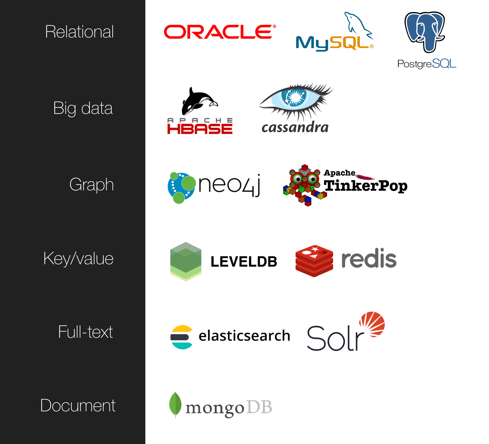
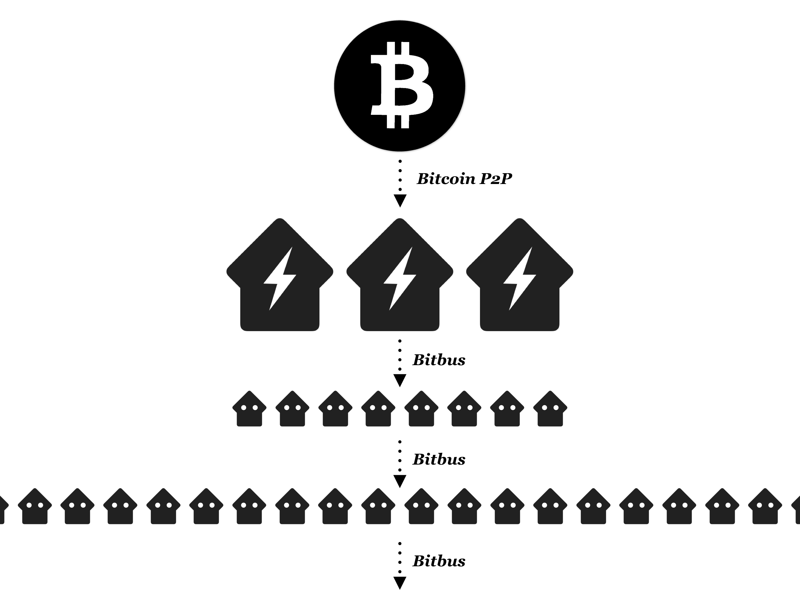

# Grid Planaria

Grid Planaria is a programmable state machine which constructs itself by crawling the Bitcoin network. 

Grid Planaria was designed as a replacement for [Planaria Version 1](https://docs.planaria.network). It is much more efficient, flexible, and powerful, and will eventually supersede Version 1.

Finally, Grid Planaria was built from scratch to be able to act as a host which powers many ["Light Nodes", also known as Neon Planaria](https://neon.planaria.network) through [Bitbus](https://bitbus.network), forming a distributed global Bitcoin data grid.


---

# Planaria Taxonomy

## 1. Planaria Types

There are three Planaria types:

1. **Planaria Version 1 (Full Node):** [The first version](https://docs.planaria.network). Will be deprecated in the future and superseded by Grid Planaria.
2. **Grid Planaria (Full Node):** Powered directly by Bitcoin. **For heavy duty infra operators.**
3. **Neon Planaria (Light Node):** Powered by [Bitbus](https://bitbus.network), which synchronizes itself by crawling a Grid Planaria. Build state machines without running a full Bitcoin node. **For app developers.**

> If you have been using the [Planaria version 1](https://docs.planaria.network), that's not going away, it will keep being maintained for bugfixes, etc. But do understand that Grid Planaria is the future, and all public Planaria nodes will also eventually migrate to Grid Planaria.

## 2. Which Planaria to Use

- If you're interested in running a heavy duty Planaria node by **directly crawling the Bitcoin network**, Grid Planaria is for you.
- If you're building a bitcoin application, **you probably don't need to run a Grid Planaria.**
  - If you want to build serverless apps, use public Planaria Endpoints. Bitcoin is not about running your own server, unless you really have to. The benefit of Bitcoin is that you can make money WITHOUT ever maintaining anything at all. For casual apps, this may be the way to go. https://docs.planaria.network/#/quickstart
  - Often you may want to own your own data and serve your users from your own server. Or maybe you can't find a public Planaria node which provides the schema you want. In this case, you can build your own backend by synchronizing ONLY the subset of the blockchain you need for your app. See Neon Planaria: https://neon.planaria.network

---

# Features

Compared to the version 1, Grid Planaria is **Minimal, Flexible, and Efficient**.

## 1. Minimal

Grid Planaria does its job and gets out of the way. It's just a simple library, not a complex Docker container (Ironically, this makes it easier to containerize it in much more flexible ways).

Instead of acting as a one-stop shop that aims to take care of everything, Grid Planaria only does what it's good at:

1. **Event Emitter:** Triggers `onstart`, `onblock`, `onmempool` events.
2. **Progress Tracker:** Keeps track of state machine progress with an abstraction called "tape", which works the same way as [Neon Planaria](https://neon.planaria.network/#/?id=how-it-works).
3. **Chain Management:** Keeps its own cached blockchain which allows for asynchronous streaming based data processing, which keeps the memory usage low and makes everything efficient.


## 2. Flexible

No container restrictions. No DB restrictions. No API restrictions. 




Unlike Planaria version 1 which came hardcoded with MongoDB, Grid Planaria doesn't make any assumptions about how developers use the framework. You can even run multiple databases. 

By minimizing the API surface, it allows developers to integrate Planaria into their existing workflow or any other technology very easily. Also it's much easier to debug.


## 3. Efficient

Grid Planaria is powered by [Bitwork](https://bitwork.network), a simple and powerful Bitcoin networking library.

- Significantly low memory usage. Maintains its own cache chain for efficiency. Uses streaming approach, which will be critical at scale.
- Directly uses the P2P protocol to crawl from the Bitcoin network, which reduces memory usage significantly.
- Also, all events are triggered directly from the P2P protocol instead of using ZeroMQ, which gets rid of occasional discrepancies and delays.


---

# Roadmap

This section discusses the future of Planaria, and how everything fits together.

## 1. The Planaria Grid

The goal of Grid Planaria is to make the delivery of Bitcoin data across the globe as efficient as possible.

To achieve this, it adopts a multi-layer approach, similar to how Electric grids have stations that step up the voltage for delivery, and then lower the voltage at the consumer facing stage.

---


---

You can think of Planaria Grid as follows:

1. **Grid Planaria:**
  - The transformer which is connected to the power plant (Bitcoin)
  - Steps up voltage for efficient delivery (Deserializes into a structured format, stores everything as a generic schema, and creates a massive index for efficient filtering)
  - These Planaria nodes should be heavy-duty massive nodes which focus ONLY on efficiency. 
  - Example: Append-only, generic state machines such as [Neon Genesis](https://medium.com/@_unwriter/neon-genesis-387fd2f122de) and [BOB](https://medium.com/@_unwriter/hello-bob-94701d278afb).
2. **Neon Planaria:** 
  - The transformer which directly faces the consumers (Applications)
  - Steps down voltage for consumption (Filter and transform blockchain data for app specific purposes) 
  - Example: Application specific state machines such as [Metanet](https://medium.com/@_unwriter/the-metanet-starts-84f255a65782) and [MOM](https://medium.com/@_unwriter/mom-8ef894910e63)

The intention is to create a globally distributed Bitcoin grid network which not only **delivers** data efficiently, but also **stores** them in as resilient manner as possible.


> **NOTE**
>
> Most application developers don't need to use Grid Planaria.
> If you're an app developer who just need a way to constantly synchronize only the subset of the blockchain you need for your app, use [Neon Planaria](https://neon.planaria.network), which is powered by [Bitbus](https://bitbus.network). You don't even need to run your own blockchain.

## 2. How it works

The grid already exists and is already fully functional.

If you have used [Metanet Planaria](https://medium.com/@_unwriter/the-metanet-starts-84f255a65782) or [MOM Planaria](https://medium.com/@_unwriter/mom-8ef894910e63), you are already a part of the Planaria grid.

The grid is formed by connecting Grid Planaria with [Neon Planaria](https://neon.planaria.network) through [Bitbus](https://bitbus.network).


However, this is just the minimum configuration. The grid extends beyond the first edge between Grid Planaria and Neon Planaria. 

The real grid must be much more distributed in order to avoid a single point of failure.

## 3. Massively Distributed

The goal is to create a topology which ensures that no single entity is responsible for the entirety of the grid and there is no single point of failure.

Also the nodes should be able to connect to one another easily, creating a self healing network.

This will be made possible when [Neon Planaria](https://neon.planaria.network) can also act as a host for another Neon Planaria, through [Bitbus](https://bitbus.network).

This way we can create a massively distributed Bitcoin data grid network which can stay resilient. 

> **Note that each edge in the below diagram is a monetization opportunity.**





## 4. Current Status

The grid is already functional (albeit at a small scale). Here are the nodes already powered by the grid paradigm:

- [MOM](https://medium.com/@_unwriter/mom-8ef894910e63) is connected to [BOB](https://medium.com/@_unwriter/hello-bob-94701d278afb) Grid.
- [Metanet](https://medium.com/@_unwriter/the-metanet-starts-84f255a65782) is connected to [Neon Genesis](https://medium.com/@_unwriter/neon-genesis-387fd2f122de) Grid.

It's a humble beginning, but perfectly shows that it is possible. Most developers probably didn't even know the MOM and Metanet APIs were Neon Planaria, and that's the point.

Over the coming months, some of the crucial moving parts that form the grid will be rolled out, and everything mentioned above will be available to more developers. The release of Grid Planaria is the first step.

Interested in this future direction? Stay updated:

> Follow on Twitter: [@_unwriter](https://twitter.com/_unwriter)
> 
> Contact: unwriter@protonmail.com
>
> Join Slack: https://bitdb.network/atlantis

---

# Quickstart: Let's make BOB.

Let's build BOB. 

To further understand what's going on, you can read the [API Documentation](#api).

## 1. Install Bitcoin

Grid Planaria communicates directly with Bitcoin full nodes, therefore you need access to a Bitcoin node.

> **NOTE**
>
> Most application developers don't need to use Grid Planaria.
> If you're an app developer who just want to synchronize the part of the blockchain for your app, use [Neon Planaria](https://neon.planaria.network), which is powered by [Bitbus](https://bitbus.network).

---

# Examples

Here are some example code that works out of the box:

1. [Raw](https://github.com/interplanaria/gridplanaria/blob/master/demo/raw.js): Process all transactions
2. [Filtered](https://github.com/interplanaria/gridplanaria/blob/master/demo/filtered.js): Process only the transactions that match a certain pattern
3. [Remote](https://github.com/interplanaria/gridplanaria/blob/master/demo/remote.js): Connect to a remote node
4. [TXO](https://github.com/interplanaria/gridplanaria/blob/master/demo/txo.js): Grid planaria also supports TXO serialization format which can be adopted by simply attaching the "txo" engine.

---

**First,** download the Bitcoin SV node:

<a href='https://github.com/bitcoin-sv/bitcoin-sv/releases' class='btn'>Visit Bitcoin SV Node Download Page ></a>

After installation, check that Bitcoin is running and JSON-RPC is functioning correctly by trying the terminal command:

```
bitcoin-cli getblockchaininfo
```

If this returns a normal result, you're set to go!


---

**Second,** set your JSON-RPC username and password inside `bitcoin.conf`.

Here's an example `bitcoin.conf` file to get your Bitcoin node to work with Planaria:

```
# location to store blockchain and other data.
datadir=/Bitcoin
dbcache=4000
# Must set txindex=1 so Bitcoin keeps the full index
txindex=1

# [rpc]
# Accept command line and JSON-RPC commands.
server=1
# Default Username and Password for JSON-RPC connections
rpcuser=root
rpcpassword=bitcoin

# If you want to allow remote JSON-RPC access
rpcallowip=0.0.0.0/0
# [wallet]
disablewallet=1

rpcworkqueue=512

# Support large mempool
maxmempool=6000

# Support large pushdata
datacarriersize=100000

# Long mempool chain support
limitancestorsize=100000
limitdescendantsize=100000
```

## 2. Program Planaria Node

Let's try creating a Planaria, which takes care of the "Write" part.

By default Grid Planaria uses the [BOB](https://medium.com/@_unwriter/hello-bob-94701d278afb) serialization format. Therefore there is no special treatment required. You simply need to batch up all incoming events and bulk insert into the database.

First you must install the dependencies:

```
npm install --save mongodb gridplanaria
```

And then create a file `index.js`:

```
const MongoClient = require('mongodb')
const Planaria = require('gridplanaria')
// MongoDB connect function
const connect = function(cb) {
  MongoClient.connect("mongodb://localhost:27017", {
    useNewUrlParser: true, useUnifiedTopology: true
  }, function(err, client) {
    if (err) {
      console.log("retrying...")
      setTimeout(function() {
        connect(cb);
      }, 1000)
    } else {
      cb(client.db("planaria"))
    }
  })
}
const planaria = new Planaria();
planaria.start({
  filter: {
    from: 600340,
    host: {
      rpc: { user: "root", pass: "bitcoin", host: "127.0.0.1" },
      peer: { host: "127.0.0.1" }
    },
  },
  onmempool: async function(e) {
    console.log("onmempool = ", e.tx)
    await planaria.db.collection("u").insertMany([e.tx])
  },
  onblock: function(e) {
    console.log("onblock", e.header.height)
    return Promise.all([
      // Mempool operation
      new Promise(async (resolve, reject) => {
        if (!e.header.nextblockhash) {
          // Update Mempool ONLY after initial crawl
          console.log("REALTIME ONBLOCK")
          await planaria.db.collection("u").deleteMany({})
          let mem = await e.network.get("mempool")
          let txArrayStream = mem.tx(100) // get a stream of mempool transaction arrays
          txArrayStream.on("data", async (txArray) => {
            await planaria.db.collection("u").insertMany(txArray) // insert each batch
          })
          .on("end", resolve)
        } else {
          // During initial crawl, no need to update mempool
          resolve();
        }
      }),
      // Block operation
      new Promise(async (resolve, reject) => {
        let txArrayStream = e.tx(100) // Get a stream of transaction arrays
        txArrayStream.on("data", async (txArray) => {
          await planaria.db.collection("c").insertMany(txArray) // insert each batch
        })
        .on("end", resolve)
      })
    ])
  },
  onstart: function(e) {
    return new Promise(async function(resolve, reject) {
      // When this is the first time executing, the tape.self.start doesn't exist, so pull the docker image.
      if (!e.tape.self.start) {
        await planaria.exec("docker", ["pull", "mongo:latest"])
        await planaria.exec("docker", ["run", "-d", "-p", "27017-27019:27017-27019", "-v", process.cwd() + "/db:/data/db", "mongo:latest"])
      }
      connect(async function(db) {
        // Store db instance so it can be used elsewhere
        planaria.db = db;
        if (e.tape.self.start) {
          // The progress tape.txt file gets updated only AFTER the entire block has been completely indexed.
          // So if Planaria was shut down during the crawling, it may have still inserted some transactions.
          // Need to clear them before restarting so the block gets crawled freshly.
          await planaria.db.collection("c").deleteMany({ "blk.i": { "$gt": e.tape.self.end } })
          // Clear mempool
          await planaria.db.collection("u").deleteMany({})
          // Get mempool and Update the "u" (unconfirmed) collection
          let mem = await e.network.get("mempool")
          // mem.tx(1000) returns a node.js stream of arrays, each with 1000 items
          let txArrayStream = mem.tx(1000)
          txArrayStream.on("data", async (txArray) => {
            await planaria.db.collection("u").insertMany(txArray) // insert each batch
          })
          .on("end", resolve)
        } else {
          resolve();
        }
      })
    })
  },
})
```

And run

```
node index
```

And that's it! You'll see that Planaria has started synchronizing.

To run this persistently, you may want to use process managers like [PM2](http://pm2.keymetrics.io/).

## 3. Instant API + Explorer

This part is optional. But if you want to try querying the database immediately, you can try with [Neon Planaria](https://neon.planaria.network)'s Planarium module.

First install dependencies:

```
npm install --save neonplanaria bitquery
```

And create a `server.js` file:

```
const { planarium } = require('neonplanaria')
const bitquery = require('bitquery')
planarium.start({
  name: "BOB",
  port: 3000,
  onstart: async function() {
    let db = await bitquery.init({ url: "mongodb://localhost:27017", address: "planaria" });
    return { db: db };
  },
  onquery: function(e) {
    let code = Buffer.from(e.query, 'base64').toString()
    let req = JSON.parse(code)
    if (req.q) {
      if (req.q.find || req.q.aggregate) {
        e.core.db.read("planaria", req).then(function(result) {
          e.res.json(result)
        })
      }
    } else {
      e.res.json([])
    }
  }
})
```

Now run:

```
node server
```

And that's it! Open your browser at http://localhost:3000 and you'll see the API explorer.

To learn more about how to use Planarium to customize your own API endpoint, see the tutorial here: https://neon.planaria.network/#/?id=build-a-planarium-api-endpoint

---

# Install

```
npm install --save gridplanaria
```

---

# API

Here's a typical structure of a Grid Planaria state machine:

```
const Planaria = require('gridplanaria')
const planaria = new Planaria()
planaria.start({
  chain: {
    prune: <max chain size>,
    path: <the filesystem path to store the transactions>
  },
  filter: {
    from: <crawl start height>,
    l: {
      filter: <transaction filter function>,
      map: <transaction transform function>
    }
  },
  onmempool: async (e) => {
    /*****************************************************
    *
    *  e := {
    *    tx: <mempool transaction object>,
    *    network: <bitwork object>
    *  }
    *
    *****************************************************/
  },
  onblock: async (e) => {
    /*****************************************************
    *
    *  e := {
    *    header: <block header>,
    *    tx: <block transaction stream getter function>,
    *    tape: <planaria progress tape>,
    *    network: <bitwork instance>
    *  }
    *
    *****************************************************/
  },
  onstart: async (e) => {
    /*****************************************************
    *
    *  e := {
    *    tape: <planaria progress tape>,
    *    network: <bitwork instance>
    *  }
    *
    *****************************************************/
  }
})
```

Quick summary:

1. Planaria lets you declare event handlers `onmempool()`, `onblock()`, and `onstart()`
2. Inside each handler you can do whatever you want to do with the passed in `e` object
3. You can use the `filter.from` attribute to specify which height you will start crawling from
4. You can use the `filter.l.filter` and `filter.l.map` to filter and map all transactions before passing to `onmempool` or `onblock`.
5. You can also decide to prune the Planaria's own cache chain by specifying the `chain` factor.

Now let's go through the API in detail.

## Overview

### 1. Methods

There are three methods:

1. [start](#_4-start): start planaria
2. [rewind](#_3-rewind): rewind to a height or a block hash
3. [exec](#_2-exec): run system calls

### 2. Events

1. [onmempool](#onmempool): Triggered when there's a new mempool transaction.
2. [onblock](#onblock): Triggered when there's a new block.
3. [onstart](#onstart): Triggered when Planaria starts up (or restarts).
4. [onrewind](#onrewind): Triggered when [planaria.rewind(<hash|height>)](#_3-rewind) is called.

## Methods

### 1. Constructor

All Planaria instances must be initialized

```
const Planaria = require('gridplanaria')
const planaria = new Planaria()
```

### 2. Exec

Planaria also gives a way to make system calls. This way you can orchestrate outside processes, 3rd party engines, and even Docker containers all from your single Planaria node.js app.

```
planaria.exec(cmd[, args][,options])
```

This internally utilizes child_process.spawn natively, but returns a Promise, so you can wait for the process to finish.

This is great for pulling and running containers and waiting until it finishes.

```
await planaria.exec("docker", ["pull", "mongo:4.0.4"])
await planaria.exec("docker", ["run", "-d", "-p", "27017-27019:27017-27019", "-v", process.cwd() + "/db:/data/db", "mongo:4.0.4"])
```


### 3. Rewind

`REWIND <height|hash>` means "rewind the tape to the exact state when the `BLOCK <height|hash>` was triggered for the first time".

Internally, it creates a `REWIND <height|hash>` line in the `tape.txt` file, and the interpreter interprets this in the same way as `BLOCK <height|hash>`, which means the progress is set to right after the `BLOCK <height|hash>` was successfully processed.

Of course, there is one important distinction:

It triggers an [onrewind](#onrewind) event. So you may want to handle the [onrewind](#onrewind) event to take care of whatever rewind related operations you want.

For example, if you're trying to deal with a reorg, you may want to **"REWIND"** to the fork point, which involves not only rewinding the tape progress, but also wiping out whatever operations that have happened after the fork point so you can start fresh. So you may want to do something like this:

```
onrewind: (e) => {
  await db.deleteMany({
    "blk.i": {
      "$gt": header.height
    }
  })
}
```

### 4. Start

#### chain

By default, Grid planaria creates a replication chain which contains raw transactions for each block.

This makes it much faster if you need to recrawl or rewind the blockchain, because it doesn't have to fetch from the node itself but simply read from the cached replication chain.

You can configure this using the `chain` attribute.

- `chain`
  - `prune`: the max size of the chain to keep. Older blocks get pruned out. Note that you can set this to a small number if you're not interested in caching.
  - `path`: the path to store the Planaria cache chain.

For example:

```
planaria.start({
  chain: {
    path: process.cwd() + "/planaria_chain",
    prune: 20
  },
  ...
})
```

Above code will create an internal Planaria cache chain at path `planaria_chain`

Also this folder will contain only the 20 most recently crawled blocks.

- The cached blocks are read straight from the file
- The NON-cached blocks (New blocks or older blocks which are not part of the recent 20) are read from the P2P network


#### filter

The filter which specifies the crawler's behavior.

- `from`: The block height to start crawling from.
- `l`: The "Local" transformer. All transactions go through this transformer before triggering `onmempool` or `onblock` events. Optional.
  - `filter`: synchronous function which tests a transaction pattern
  - `map`: synchronous function which transforms a transaction


Here's an example:

```
planaria.start({
  ...
  filter: {
    start: 600000,
    l: {
      filter: (e) => {
        return e.out[0] && e.out[0].tape[1]
            && e.out[0].tape[1].cell[0]
            && e.out[0].tape[1].cell[0].s === "19HxigV4QyBv3tHpQVcUEQyq1pzZVdoAut"
            && e.out[0].tape[1].cell[2]
            && e.out[0].tape[1].cell[2].s
            && e.out[0].tape[1].cell[2].s.startsWith("image")
            && (e.out[0].tape[1].cell[1].b || e.out[0].tape[1].cell[1].lb)
      },
      map: (e) => {
        let data = t.out[0].tape[1].cell[1].b || t.out[0].tape[1].cell[1].lb
        let buffer = Buffer.from(data, 'base64');
        return { buf: buffer };
      }
    }
  },
  ...
})
```

This means:

1. `start`: Start crawling from 600000
2. `l.filter`: When triggering events, only trigger when a transaction passes the `l.filter` function. In this case it's looking for a [B://](https://b.bitdb.network) protocol, which contains an image.
3. `l.map`: when triggering events, pass them through the `l.map` function first. In this case it only selects the B:// image data, and turns it into buffer, and then only returns the buffer (instead of the entire transaction object)


#### onmempool

When there's a new mempool transaction

- `tx`: a function when invoked, returns a stream of deserialized transaction objects
- `network`: a [bitwork](https://bitwork.network) instance. Using this you can make all kinds of Bitcoin networking requests.

#### onblock

When there's a new block

- `header`: block header
- `tx`: a function when invoked, returns a stream of deserialized transaction objects
- `tape`: a progress tape for Planaria which makes it easy to keep track of synchronization progress
- `network`: a [bitwork](https://bitwork.network) instance. Using this you can make all kinds of Bitcoin networking requests.

#### onstart

Whenever Planaria starts (or restarts)

- `tape`: a progress tape for Planaria which makes it easy to keep track of synchronization progress. At the `onstart` stage, you can read the tape to run cleanup (for example, if Planaria crashed previously, you can write a cleanup logic here to clean up inserted transactions for the current block before resuming.
- `network`: a [bitwork](https://bitwork.network) instance. Using this you can make all kinds of Bitcoin networking requests.

#### onrewind

Triggered when the program explicitly calls [planaria.rewind()](#_3-rewind).

The event contains the following attributes:

- `header`: The block header of the target block
- `info`: The overall blockchain info at the moment of the event's trigger.
- `tape`: The tape state **BEFORE** the rewind. Note that the "REWIND" operation will add a new line "REWIND <height|hash>" to the tape AFTER the `onrewind` event returns.
- `network`: A [Bitwork](https://bitwork.network) instance which you can use to do any Bitcoin networking operations

---

